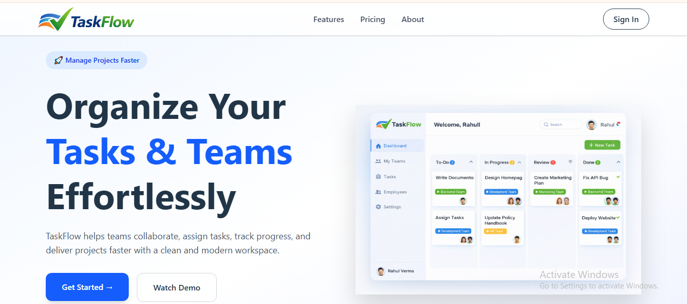
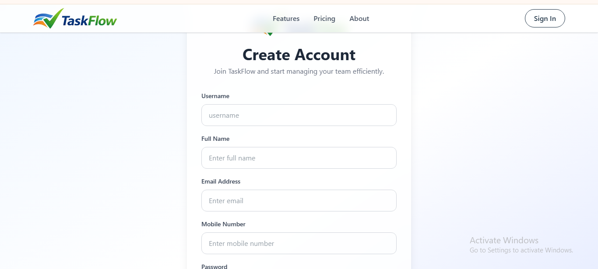
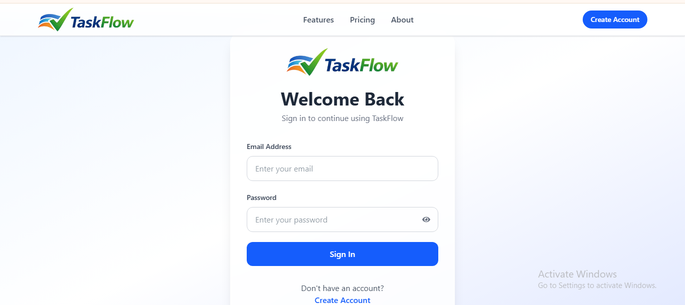
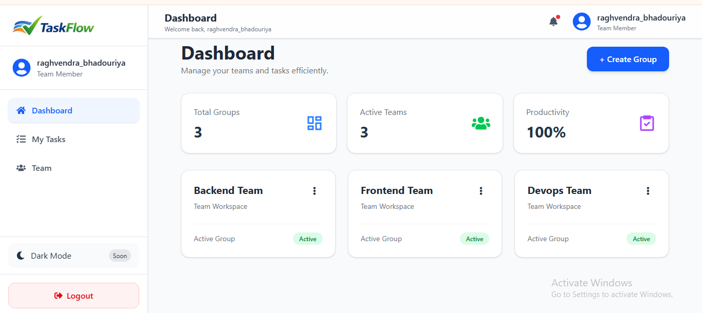
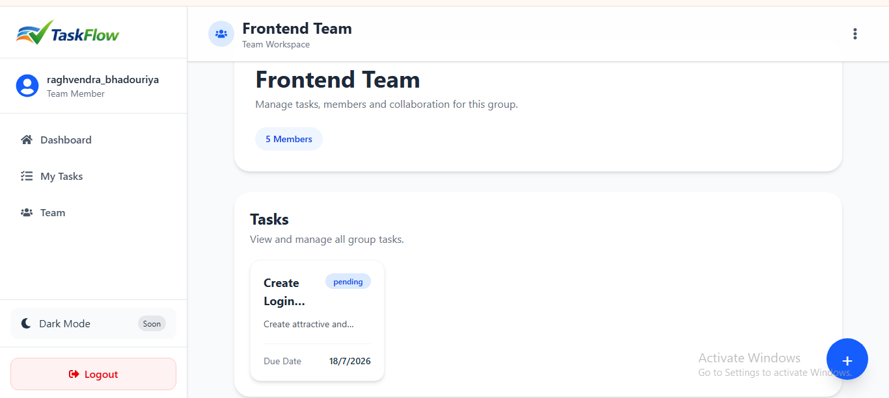
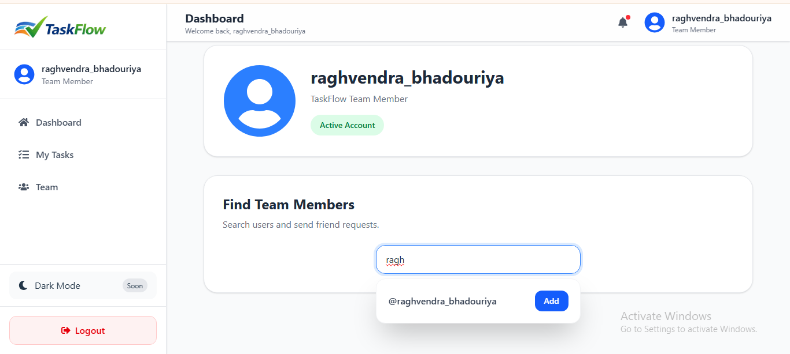

# TaskFlow-web-app

Q. What is TaskFlow?
   TaskFlow is a full-stack team collaboration and task management platform that helps teams organize projects, manage tasks, and collaborate efficiently. Users can create groups, invite team members, assign tasks, track task progress, and manage their work from a modern and responsive dashboard.

Q. The project is built using the MERN Stack and follows a client-server architecture with secure JWT authentication.

Q. Why was it built?
   TaskFlow was built to solve common challenges faced by teams while managing projects and daily tasks.

The main goals were to:

Improve team collaboration
Organize project tasks in one place
Track task progress efficiently
Learn real-world MERN Stack development
Practice JWT Authentication, REST APIs, MongoDB relationships, and Context API
Build an industry-level portfolio project for Full Stack Developer roles

Technologies Used:-
Frontend:
React.js
Vite
Tailwind CSS
React Router DOM
Axios
Context API
React Icons

Backend:
Node.js
Express.js
MongoDB
Mongoose
JWT Authentication
bcrypt
dotenv
CORS
Deployment
Frontend → Vercel
Backend → Render
Database → MongoDB Atlas
Main Features
Authentication
User Registration
User Login
JWT Authentication

Protected Routes:
Dashboard
Sidebar Navigation
User Profile
Group Workspace
Create Groups
Join Groups
View Group Members
Search Users
Add Friends
Task Management
Create Tasks
Edit Tasks
Delete Tasks
Assign Tasks to Members
Due Date Support
Task Status Management
View All Group Tasks
User Experience
Responsive Design
Loading Skeletons
Glassmorphism UI
Fast Navigation
Clean Dashboard Interface
Security
Password Hashing using bcrypt
JWT Token Authentication
Protected Backend APIs
Environment Variables using dotenv

Screenshots:

Add screenshots inside the screenshots folder.

Example:

screenshots/
│── landing.png
│── signup.png
│── signin.png
│── dashboard.png
│── group-workspace.png
│── profile.png

Then display them like this:

## Landing

## Singup

## Login

## Dashboard

## Group Workspace

## Profile

Live Demo:
Frontend
https://your-frontend.vercel.app
Backend API
https://your-backend.onrender.com

Replace these URLs with your deployed links.

Project Architecture
                    ┌────────────────────┐
                    │      Browser       │
                    └─────────┬──────────┘
                              │
                              │ HTTP Requests
                              ▼
                    ┌────────────────────┐
                    │ React Frontend     │
                    │ (Vite + Tailwind)  │
                    └─────────┬──────────┘
                              │
                       Axios REST API
                              │
                              ▼
                    ┌────────────────────┐
                    │ Express.js Server  │
                    └─────────┬──────────┘
                              │
                   JWT Authentication
                              │
                              ▼
                    ┌────────────────────┐
                    │ MongoDB Atlas      │
                    └────────────────────┘

How to Run the Complete Application

1. Clone the Repository
git clone https://github.com/yourusername/taskflow.git

2. Frontend Setup
cd frontend

npm install

npm run dev

Frontend will start at

http://localhost:5173

3. Backend Setup
cd backend

npm install

npm start

or

npm run dev

Backend will start at

http://localhost:8080

4. Environment Variables

Create a .env file inside the backend folder.

Example:

PORT=8080

MONGO_URI=your_mongodb_connection_string

JWT_SECRET=your_secret_key

5. Open the Application

Open your browser:

http://localhost:5173
Folder Structure
TaskFlow/

│
├── frontend/
│   ├── src/
│   ├── public/
│   └── README.md
│
├── backend/
│   ├── config/
│   ├── Middleware/
│   ├── Models/
│   ├── Routes/
│   ├── README.md
|   └── server.js
│
└── README.md
Links to Frontend and Backend Documentation
📂 Frontend Documentation

./frontend/README.md

📂 Backend Documentation

./backend/README.md

Or, if you're using GitHub:

## Documentation

- [Frontend Documentation](./frontend/README.md)
- [Backend Documentation](./backend/README.md)